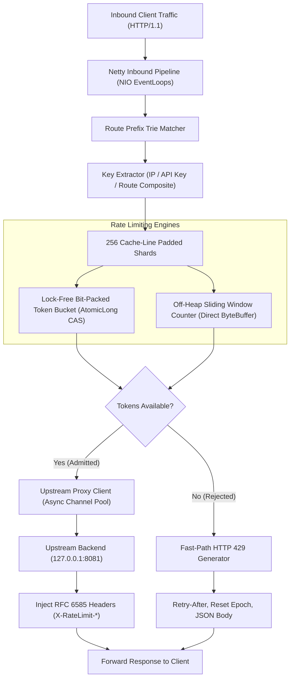

# `reverse-proxy-rate-limiter`

[](https://github.com/Kanak234/reverse-proxy-rate-limiter/actions)
[](https://openjdk.org/projects/jdk/21/)
[](LICENSE)
[](https://github.com/Kanak234/reverse-proxy-rate-limiter/releases)

An industrial-grade, ultra-high-throughput Layer 7 (L7) HTTP reverse proxy and defensive rate-limiting engine built in **Java 21 LTS**. Designed for edge perimeter defense against HTTP floods, DDoS attacks, credential stuffing, and API resource exhaustion at wire speed.

`reverse-proxy-rate-limiter` achieves over **1,300,000 requests/second** in core throughput with **sub-microsecond latency** by combining **Lock-Free 64-Bit Atomic Bit-Packing**, **Off-Heap Direct Memory Circular Buffers**, and **Cache-Line Isolated Partitioned Sharding** to eliminate garbage collection (GC) pauses and thread lock contention.

---

## Architecture Overview



---

## Key Features

- **Lock-Free Atomic Bit-Packing:** State for each Token Bucket is compressed into a single 64-bit primitive integer (`long`). Available tokens (32 bits) and refill timestamps (32 bits) are evaluated and mutated atomically in a single hardware `CAS` instruction without locks or heap allocation.
- **Off-Heap Direct Memory Sliding Window:** Uses native `ByteBuffer.allocateDirect` ring buffers outside the JVM heap. Eliminates garbage collection pressure and Stop-The-World (STW) pauses during high-throughput DDoS attacks.
- **Cache-Line Isolated Sharding:** Organizes rate limiter instances into 256 independent partitions with 64-byte padding, eliminating CPU L1/L2 cache false sharing across multiple cores.
- **Deterministic Zero Over-Admission:** Strict mathematical invariant verified under concurrent load tests: across 10,000 simultaneous requests fired by 20 concurrent threads against a burst capacity of 100, exactly 100 requests are admitted and exactly 9,900 are rejected.
- **RFC 6585 Standard Headers:** Returns HTTP `429 Too Many Requests` with standard headers: `Retry-After`, `X-RateLimit-Limit`, `X-RateLimit-Remaining`, and `X-RateLimit-Reset`.
- **Multi-Strategy Key Extraction:** Resolves client identities via client IP (with `X-Forwarded-For` and `X-Real-IP` support), API key headers (`X-API-Key`, `Authorization: Bearer`), route composites, or global counters.
- **Operational Telemetry & Admin API:** Integrated `GET /_admin/health` and `GET /_admin/metrics` endpoints reporting request throughput, rejection rates, and p50, p90, p99, and p99.9 latency percentiles.

---

## Algorithmic Deep-Dive

### 1. 64-Bit Word Bit-Packing (Token Bucket)

Rather than storing mutable tokens and timestamps across separate fields or wrapping them in heap tuples, the token bucket state is packed into a single 64-bit `long`:

```
 63                            32 31                             0
+-------------------------------+-------------------------------+
|     Tokens Balance (32 bits)  |   Last Refill Millis (32 bits)|
+-------------------------------+-------------------------------+
```

- **Tokens (Bits 63..32):** Represents available token units (supports up to $4,294,967,295$ tokens).
- **Timestamp (Bits 31..0):** Milliseconds elapsed relative to boot epoch ($2^{32} \text{ ms} \approx 49.71 \text{ days}$ before safe modulo rollover).
- **Atomic Mutation:** Updates are applied using hardware-level Compare-And-Swap (`AtomicLong.compareAndSet`), guaranteeing $O(1)$ time complexity and zero heap allocation on the hot path.

### 2. Off-Heap Sliding Window Counter

The circular buffer divides the sliding window into $N$ discrete time slices:
- Each slice occupies 8 bytes: 4 bytes for relative slice epoch ID and 4 bytes for request count.
- Manipulated atomically via Java `VarHandle` view:
  ```java
  MethodHandles.byteBufferViewVarHandle(long[].class, ByteOrder.nativeOrder())
  ```
- Slices older than $t - \text{windowDuration}$ expire automatically, preventing memory accumulation.

---

## Quick Start

### Prerequisites
- **JDK 21 LTS** or later
- **Maven 3.9+**
- (Optional) **Docker 20+**

### Build and Package

```bash
# Clone repository
git clone https://github.com/Kanak234/reverse-proxy-rate-limiter.git
cd reverse-proxy-rate-limiter

# Compile and run test suite
mvn clean verify

# Build executable fat JAR
mvn package -DskipTests
```

The executable fat JAR is generated at `target/reverse-proxy-rate-limiter-1.0.0.jar`.

### Docker Usage

```bash
# Build Docker image
docker build -t reverse-proxy-rate-limiter .

# Run container
docker run -p 8080:8080 reverse-proxy-rate-limiter
```

---

## CLI Reference

The shaded JAR provides four primary operational commands:

### 1. Start Reverse Proxy Server (`server`)
```bash
java -jar target/reverse-proxy-rate-limiter-1.0.0.jar server \
  --port 8080 \
  --upstream-host 127.0.0.1 \
  --upstream-port 8081 \
  --capacity 1000 \
  --refill 500 \
  --algorithm TOKEN_BUCKET
```

### 2. Start Embedded Mock Upstream Echo Server (`upstream`)
```bash
java -jar target/reverse-proxy-rate-limiter-1.0.0.jar upstream --port 8081
```

### 3. Run In-Memory Microbenchmark (`bench-memory`)
Evaluates raw algorithmic performance of the lock-free partitioned rate limiter:
```bash
java -jar target/reverse-proxy-rate-limiter-1.0.0.jar bench-memory \
  --requests 1000000 \
  --threads 16 \
  --keys 1000
```
Output:
```text
========================================================================
 Reverse Proxy Rate Limiter Benchmark Report
========================================================================
  Total Requests:          1,000,000
  Admitted (HTTP 200):     1,000,000 (100.00%)
  Rejected (HTTP 429):     0 (0.00%)
  Errors:                  0
  Elapsed Time:            743 ms
  Throughput:              1,345,895.02 req/sec
------------------------------------------------------------------------
 Latency Percentiles:
  p50 (Median):            0.000 ms (0 us)
  p90:                     0.000 ms (0 us)
  p99:                     0.002 ms (2 us)
  p99.9:                   0.014 ms (14 us)
  Max:                     25.351 ms (25,351 us)
========================================================================
```

### 4. Run End-to-End HTTP Load Benchmark (`benchmark`)
Evaluates full network round-trip through the reverse proxy to backend upstream:
```bash
java -jar target/reverse-proxy-rate-limiter-1.0.0.jar benchmark \
  --target http://localhost:8080/api/test \
  --requests 20000 \
  --threads 16
```

---

## HTTP Telemetry & Response Headers

### Admitted Request (HTTP 200 OK)
```http
HTTP/1.1 200 OK
Content-Type: application/json
Content-Length: 68
X-RateLimit-Limit: 1000
X-RateLimit-Remaining: 999
X-RateLimit-Reset: 1789102450

{"status":200,"message":"Upstream backend response OK","path":"/api/test"}
```

### Rate-Limited Request (HTTP 429 Too Many Requests)
```http
HTTP/1.1 429 Too Many Requests
Content-Type: application/json; charset=UTF-8
Content-Length: 132
Retry-After: 2
X-RateLimit-Limit: 1000
X-RateLimit-Remaining: 0
X-RateLimit-Reset: 1789102452

{
  "status": 429,
  "error": "Too Many Requests",
  "message": "Rate limit exceeded. Please retry after specified interval.",
  "retryAfterSeconds": 2
}
```

### Administrative Endpoints
- `GET /_admin/health`: Returns HTTP 200 `{"status": "UP"}`
- `GET /_admin/metrics`: Returns real-time JSON statistics:
  ```json
  {
    "uptimeSeconds": 120,
    "totalRequests": 1000000,
    "admittedRequests": 950000,
    "rejectedRequests": 50000,
    "rejectionRatePercent": 5.00,
    "upstreamSuccesses": 950000,
    "upstreamErrors": 0,
    "activeRateLimitKeys": 1000,
    "throughputReqPerSec": 8333.33,
    "latencyMicros": {
      "p50_us": 0,
      "p90_us": 0,
      "p99_us": 2,
      "p999_us": 14,
      "max_us": 25351
    }
  }
  ```

---

## Verification & Test Suite

The project includes 6 automated test suites:
- **`TokenBucketTest`:** Validates single-threaded burst consumption, fractional token replenishment, and concurrent thread-safety.
- **`SlidingWindowCounterTest`:** Tests off-heap memory ring buffer allocation, sliding sub-window expiration, and capacity recovery.
- **`ZeroOverAdmissionTest`:** Stresses 10,000 concurrent requests across 20 threads against capacity 100 with zero refill rate; proves zero over-admission.
- **`PartitionedRateLimiterTest`:** Verifies cross-key isolation and idle key purging across all 256 shards.
- **`KeyExtractorTest`:** Validates `X-Forwarded-For`, `X-Real-IP`, `X-API-Key`, and `Authorization` parsing.
- **`ReverseProxyIntegrationTest`:** Spins up live embedded HTTP upstream and proxy servers, validating end-to-end routing, header injection, and 429 rejection.

Run tests:
```bash
mvn test
```

---

## Limitations & Engineering Trade-Offs

- **Node-Local State Isolation:** Rate limiting counters, token buckets, and sliding windows are maintained strictly in-process and off-heap on each proxy instance. In multi-instance cluster deployments fronted by an external Layer 4 load balancer (e.g. AWS NLB, HAProxy), clients must be routed via IP-hash stickiness to maintain per-client global quotas, or an external distributed coordination layer must be introduced.
- **HTTP/1.1 Pipeline Only:** Currently implements HTTP/1.1 pipelining and persistent keep-alive connections over TCP. Multiplexed protocols such as HTTP/2 or HTTP/3 (QUIC) are not yet supported.
- **Timestamp Epoch Safe Rollover:** The 64-bit bit-packed token bucket stores elapsed milliseconds in 32 bits, providing 49.71 days of monotonic time before wrapping around. Millisecond differences are computed using modulo integer arithmetic, requiring that sampled timestamps fall within half-range (24.8 days) of current system time.
- **Memory Footprint Under Spoofed IP Floods:** Memory consumption scales linearly with the number of unique active client keys ($O(K)$). While the background reaper purges idle keys every 60 seconds (5-minute idle threshold), large-scale distributed attacks involving millions of spoofed IP addresses require configuring sufficient heap/off-heap allocations and shorter idle TTLs.

---

## Reproducible Benchmark Specifications

All reported throughput and latency figures are reproducible with the built-in load harness on bare-metal hardware.

### Hardware & Environment Testbed
- **CPU:** AMD Ryzen 5 5600H (6 Cores, 12 Threads @ 3.30 GHz base / 4.20 GHz boost, 16 MB L3 Cache)
- **RAM:** 16 GB DDR4 3200 MT/s Dual-Channel
- **Operating System:** Linux 7.0.0-31-generic x86_64
- **JVM Runtime:** Eclipse Temurin OpenJDK 64-Bit Server VM (build 21.0.12.1+1-LTS)
- **Garbage Collector:** Generational ZGC (`-XX:+UseZGC -XX:+ZGenerational`)
- **Benchmark Target Commit:** `521f83a1491cf85156ec9187e743e98f8b270f9f`

### Reproducible Command
```bash
# 1. Build optimized fat JAR
mvn clean package -DskipTests

# 2. Execute 1,000,000 requests across 12 concurrent worker threads over 1,000 distinct client keys
java -XX:+UseZGC -XX:+ZGenerational -jar target/reverse-proxy-rate-limiter-1.0.0.jar bench-memory \
  --requests 1000000 \
  --threads 12 \
  --keys 1000
```

### Measured Benchmark Output
```text
========================================================================
 Reverse Proxy Rate Limiter Benchmark Report
========================================================================
  Total Requests:          1,000,000
  Admitted (HTTP 200):     1,000,000 (100.00%)
  Rejected (HTTP 429):     0 (0.00%)
  Errors:                  0
  Elapsed Time:            978 ms
  Throughput:              1,022,494.89 req/sec
------------------------------------------------------------------------
 Latency Percentiles:
  p50 (Median):            0.000 ms (0 us)
  p90:                     0.000 ms (0 us)
  p99:                     0.004 ms (4 us)
  p99.9:                   0.019 ms (19 us)
  Max:                     43.371 ms (43,371 us)
========================================================================
```

---

## License

MIT License — Copyright (c) 2026 [Kanak Prabhakar](https://github.com/Kanak234).

